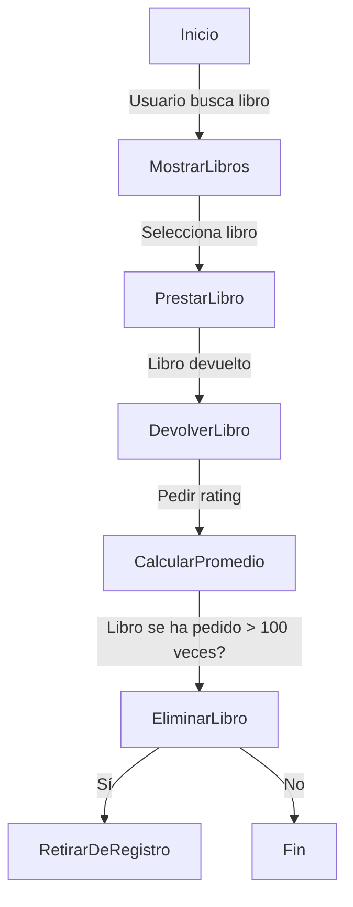

# Práctica 1: Biblioteca con CORBA  

Este proyecto implementa un sistema de gestión de biblioteca distribuida utilizando CORBA en Java. Se incluyen funciones como la consulta de libros disponibles, préstamo y devolución con un sistema de calificación.  

---

## Requisitos  
Antes de ejecutar la aplicación, asegúrate de tener:  
- **Java Development Kit (JDK)** (VERSIÓN 8) 
- **CORBA IDL Compiler** (`idlj`)  
- **Editor**: En nuestro caso, empleamos Visual Studio Code, se podría utilizar otros también compatibles como IntelliJ IDEA o Eclipse  
- **Sistema operativo**: Windows en nuestro caso. 

---

##  Instrucciones de ejecución  

1️⃣ **Compilar el archivo IDL**  
```sh
idlj -fall Biblioteca.idl
```

2️⃣ **Compilar los archivos Java**
```sh
javac ServidorBiblioteca.java
javac ClienteBiblioteca.java
```

3️⃣ **Ejecutar el servicio de nombres (en una terminal)**
```sh
tnameserv -ORBInitialPort 1050
```
4️⃣ **Ejecutar el servidor (en una segunda terminal)**
```sh
java ServidorBiblioteca -ORBInitialHost localhost -ORBInitialPort 1050
```

5️⃣**Ejecutar el cliente (en una tercera terminal)**
```sh
java ClienteBiblioteca -ORBInitialHost localhost -ORBInitialPort 1050
```

---

## Funcionalidades añadidas  

**Mostrar los libros disponibles**: Se agregó una función para listar solo los libros que no están prestados.  

**Valoración de libros**: Se solicita al usuario que devuelva el libro y califique con estrellas (1-5). Luego, se calcula la media de calificaciones.  

**Seguimiento de préstamos**: Se cuenta cuántas veces se ha prestado un libro. Si supera 100 préstamos, se retira del catálogo por desgaste.  


--- 


## Diagrama de flujo 

